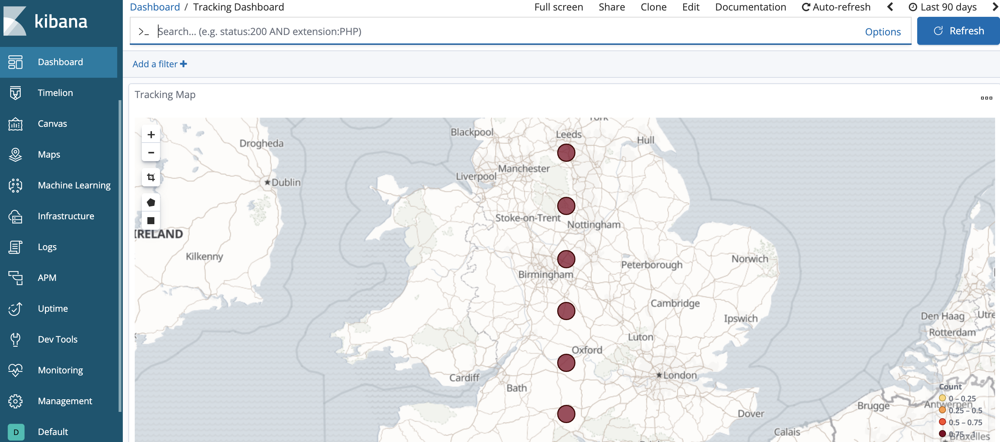

= Delivery Tracking System

In this project we’re going to create a real time deliver tracking system using KSQL streams.
We're going to use kafka connect component to ingest data from MySQL and egress it to elasticsearch/kibana.

== Run docker containers via docker compose

[source,bash]
----
docker-compose up -d
----

This brings up the stack, and also loads the necessary Kafka Connect, MQTT Server, Elasticsearch, and Kibana configuration.

== Create Kafka Streams/Tables
[source,bash]
----
docker-compose exec ksql-cli bash -c 'echo -e "\n\n⏳ Waiting for KSQL to be available before launching CLI\n"; while [ $(curl -s -o /dev/null -w %{http_code} http://ksql-server:8088/) -eq 000 ] ; do echo -e $(date) "KSQL Server HTTP state: " $(curl -s -o /dev/null -w %{http_code} http://ksql-server:8088/) " (waiting for 200)" ; sleep 5 ; done; ksql http://ksql-server:8088'
----

[source,sql]
----
LIST TOPICS
----

You should see topics ingested from MySql:

Create tracking Streams/Tables:

[source,sql]
----
SET 'auto.offset.reset' = 'earliest';

CREATE STREAM TRACKS_STREAM WITH (KAFKA_TOPIC='asgard.demo.tracks', VALUE_FORMAT='AVRO');
CREATE STREAM TRACKS_REKEYED WITH (PARTITIONS=1) AS SELECT * FROM TRACKS_STREAM PARTITION BY TRACK_ID;
CREATE TABLE TRACKS WITH (KAFKA_TOPIC='TRACKS_REKEYED',VALUE_FORMAT='AVRO',KEY='TRACK_ID');

CREATE STREAM DELIVERY_ORDERS_STREAM WITH (KAFKA_TOPIC='asgard.demo.delivery_orders', VALUE_FORMAT='AVRO');
CREATE STREAM DELIVERY_ORDERS_REKEYED WITH (PARTITIONS=1) AS SELECT * FROM DELIVERY_ORDERS_STREAM PARTITION BY ORDER_ID;
CREATE TABLE DELIVERY_ORDERS WITH (KAFKA_TOPIC='DELIVERY_ORDERS_REKEYED',VALUE_FORMAT='AVRO',KEY='ORDER_ID');

CREATE STREAM DELIVERY_TRACKING ( \
    order_id INT,
    track_id VARCHAR, \
    location STRUCT<lon DOUBLE, lat DOUBLE>, \
    timestamp VARCHAR) \
WITH ( \
    VALUE_FORMAT='JSON', \
    KAFKA_TOPIC = 'delivery_tracking', \
    KEY = 'order_id');

CREATE STREAM DELIVERY_TRACKING_ENRICHED_1 WITH (PARTITIONS=1) AS SELECT \
    t.order_id AS order_id, t.track_id AS track_id, t.location AS location, tr.brand AS track_brand
FROM DELIVERY_TRACKING t JOIN TRACKS tr ON tr.track_id = t.track_id;

CREATE STREAM DELIVERY_TRACKING_ENRICHED_2 WITH (PARTITIONS=1) AS SELECT \
    t.order_id AS order_id, t.track_id AS track_id, t.location AS location, t.track_brand AS track_brand, o.destination AS destination, o.email AS customer_email
FROM DELIVERY_TRACKING_ENRICHED_1 t JOIN DELIVERY_ORDERS o ON o.order_id = t.order_id;

CREATE STREAM DELIVERY_TRACKING_DEST_DISTANCE WITH (PARTITIONS=1) \
AS SELECT order_id, track_id, customer_email, GEO_DISTANCE(location->lat, location->lon, destination->x, destination->y, 'KM') AS distance FROM DELIVERY_TRACKING_ENRICHED_2;

CREATE STREAM DELIVERY_TRACKING_DEST_DISTANCE_ALERTED ( \
    order_id INT
    )
WITH ( \
    VALUE_FORMAT='JSON', \
    KAFKA_TOPIC = 'delivery_tracking_dest_distance_alerted', \
    KEY = 'order_id');

CREATE STREAM DELIVERY_TRACKING_DEST_DISTANCE_ALERT AS SELECT t.order_id AS order_id, t.customer_email AS customer_email FROM DELIVERY_TRACKING_DEST_DISTANCE t WHERE t.DISTANCE < 20
----

== To see MySQL data launch MySQL CLI

[source,bash]
----
docker-compose exec mysql bash -c 'mysql -u $MYSQL_USER -p$MYSQL_PASSWORD demo'
----

[source,sql]
----
SHOW TABLES;
----

== Run delivery alert script

[source,bash]
----
python scripts/delivery-alert.py
----

== Send the data to MQTT

[source,bash]
----
docker-compose up kafka-mqtt-client
----

== Kibana Visualisation

http://localhost:5601/app/kibana#/management/kibana/objects?_g=()[Open Kibana and import dashboard (scripts/kibana-dashboard.json)]

You should see kibana dashboard like

